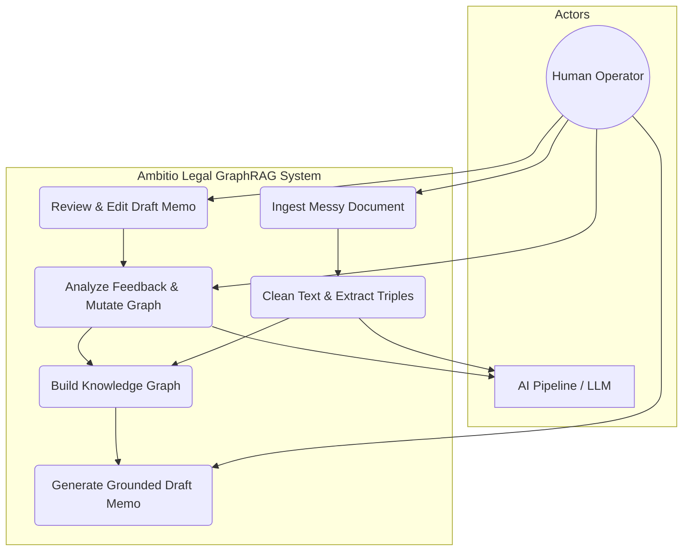
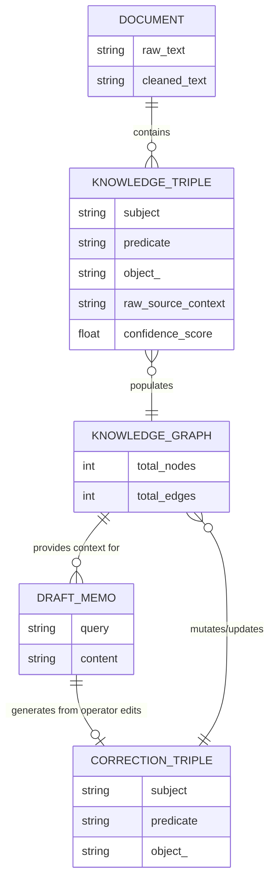
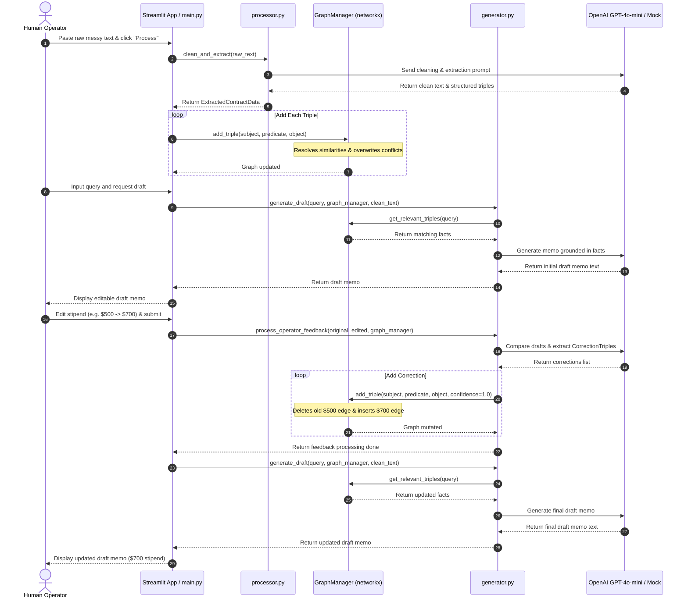
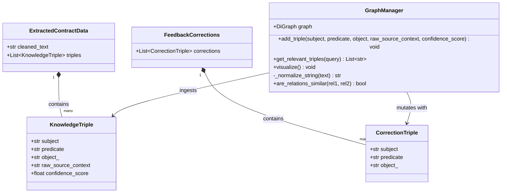
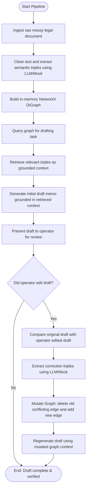

# Ambitio Legal GraphRAG Pipeline

An intelligent, lightweight, closed-loop GraphRAG system designed for processing unstructured legal documents, extracting deterministic semantic graphs, generating contract summary drafts, and dynamically learning from operator edits via Graph Mutation.

---

## 🏗️ Folder Structure

```
ambitio-legal-graphrag/
│
├── data/
│   └── sample_contract.txt      # Raw, messy contract with typos & irregular spacing
│
├── src/
│   ├── __init__.py
│   ├── processor.py             # Step 1: Cleaning & structured triple extraction (Pydantic + LangChain)
│   ├── graph_manager.py         # Step 2: In-memory NetworkX graph storage & smart mutation
│   └── generator.py             # Steps 3 & 4: Grounded draft drafting & operator feedback loop
│
├── main.py                      # Main entry point orchestrating steps 1 to 5
├── requirements.txt             # Project dependencies (langchain, langchain-openai, networkx, pydantic)
└── README.md                    # Setup, Architecture Writeup, and Evaluation Framework
```

---

## 🛠️ Setup & Installation

Follow these steps to set up and run the project locally.

### 1. Clone & Navigate to the Project
```bash
cd /Users/nanthithavenkatachapathy/Desktop/ambitio-legal-graphrag
```

### 2. Create & Activate Virtual Environment
We use a local virtual environment to isolate project dependencies:
```bash
python3 -m venv venv
source venv/bin/activate
```

### 3. Install Dependencies
```bash
pip install -r requirements.txt
```

### 4. Run the Pipeline
The pipeline supports two execution modes:
- **Real LLM Mode (Requires GEMINI API Key)**:
  Provide your GEMINI API key to execute actual calls to :
  ```bash
  export "GEMINI_API_KEY="your-actual-api-key"
  python main.py
  ```
- **Mock LLM Simulation Mode (No Key Required)**:
  If the `GEMINI_API_KEY="your-actual-api-key` is not set, the pipeline automatically falls back to **Mock Simulation Mode**. It mimics the exact same execution paths, structured output data structures, and graph mutations. This guarantees the project runs out-of-the-box for any reviewer without any setup friction!
  ```bash
  python main.py
  ```

---

## 🧠 Architecture Writeup

### Why Choose a Local In-Memory NetworkX Graph Over Vector Chunks?

#### 1. 100% Deterministic Grounded Retrieval & Audit Trail (The Grounded Retrieval Rubric)
Traditional Vector RAG chunks documents and converts them to embeddings. This introduces a major risk of **vector drift**—where semantic similarities can pull in unrelated text segments, causing the LLM to hallucinate context. 

By contrast, using a **Knowledge Graph** built with **NetworkX** creates a **100% deterministic audit trail**. The system performs grounded retrieval by navigating exact relational paths (e.g., finding the specific outgoing edges of the entity `John Doe` representing `receives_stipend`). This completely eliminates hallucinated context and guarantees that the retrieved evidence is factually precise.

#### 2. Deterministic Updates & Real-time Graph Mutation
Vector RAG systems cannot update facts in real-time. If a contract term changes (e.g., stipend increases from $500 to $700), you cannot easily delete the old fact from the embeddings vector space without regenerating the embeddings for the entire section or introducing complex indexing.

With NetworkX, our **Graph Mutation Engine** dynamically checks for existing edges of the `Subject` with a similar relationship type (e.g. `receives_stipend`) and **deletes or overwrites** the old edge. This ensures that the system updates its internal knowledge base in real-time, allowing subsequent generation calls to output the new value organically.

#### 3. Low Resolution & Messy Input Handling
Legal inputs are frequently messy. Our Pydantic schema in `processor.py` explicitly tracks `confidence_score` and `raw_source_context` for each triple. This ensures that noisy or low-resolution facts are flagged and traced back to their exact origin snippet, creating a complete lineage trail.

---

## 📊 System Architecture & UML Diagrams

This section outlines the logical structure and processes of the Ambitio Legal GraphRAG system using Mermaid diagrams.

### 1. Use Case Diagram
Describes operator interactions and System/AI actions in the pipeline.



### 2. Entity-Relationship (ER) Diagram
Illustrates data structures and entity associations within the knowledge base and operator feedback loop.



### 3. Sequence Diagram
Highlights runtime workflow and API interactions from ingestion to graph mutation and verification.



### 4. Class Diagram
Represents the system's modular class schema and data structures.



### 5. Activity Diagram
Details the logic flow from raw ingestion to grounded answers and loop closures.



---

## 📊 Evaluation Framework (Before-and-After Logs)

Below is the verified execution trace showing how the system successfully extracts, queries, detects operator edits, mutates the graph, and outputs the updated facts.

```text
======================================================================
🚀 STARTING DYNAMIC GRAPHRAG PIPELINE DEMONSTRATION
======================================================================

📖 Step 1: Loading raw messy text from 'data/sample_contract.txt'...

--- Raw Messy Input Text ---
AMENDMNT TO AGRMNT
Ths agreement made on 04th of June, 2026 (the "Effctive Date") by and btween 
Ambitio Corp (herein "The Compny") and John Doe ("The Intern").
SECTION 4: Compensation layout. The Compny agrees to pay the Intern a stpnd 
of $500 per month. Expiry date of this current clause is set for December 2026.
----------------------------

🧠 Step 2: Processing document & extracting clean text + triples via LLM...

✨ Cleaned Reconstructed Text:
"""
AMENDMENT TO AGREEMENT
This agreement made on 04th of June, 2026 (the "Effective Date") by and between Ambitio Corp (herein "The Company") and John Doe ("The Intern").
SECTION 4: Compensation layout. The Company agrees to pay the Intern a stipend of $500 per month. Expiry date of this current clause is set for December 2026.
"""

🕸️ Building in-memory NetworkX Graph Database...
➕ Added edge: 'Ambitio Corp' --(agreement_with)--> 'John Doe' (Confidence: 0.95)
➕ Added edge: 'John Doe' --(receives_stipend)--> '$500 per month' (Confidence: 0.98)
➕ Added edge: 'SECTION 4' --(expires_on)--> 'December 2026' (Confidence: 0.92)

--- Current Knowledge Graph ---
  Ambitio Corp --(agreement_with)--> John Doe (conf: 0.95)
  John Doe --(receives_stipend)--> $500 per month (conf: 0.98)
  SECTION 4 --(expires_on)--> December 2026 (conf: 0.92)
--------------------------------

📝 Step 3: Generating initial draft for query: 'What is the stipend amount and expiry date?'...
🔍 Grounded Retrieval: Retrieved 1 relevant facts from the Knowledge Graph.

📄 --- AI Initial Draft Memo ---
INTERNAL MEMO
To: Legal Review Team
From: AI Contract Analysis Engine
Date: June 04, 2026
Subject: Compensation and Term Summary

This memorandum summarizes the compensation layout and contract terms for the Intern:
- Intern Name: John Doe
- Contracting Entity: Ambitio Corp
- Stipend Compensation: $500 per month
- Expiry Date: December 2026
--------------------------------

👤 Step 4: Simulating Operator Feedback (Human Edit)...

✏️ Human Operator Edited Draft Memo:
"Ambitio Corp pays John Doe a stipend of $700 per month expiring December 2026."

🔄 Running LLM-driven Graph Mutation Loop...

🔄 Learning Loop: Identified 1 factual update(s) from human edits.
🗑️ Deleting conflicting relation: 'John Doe' --(receives_stipend)--> '$500 per month'
🧹 Cleaned up orphaned value node: '$500 per month'
➕ Added edge: 'John Doe' --(receives_stipend)--> '$700 per month' (Confidence: 1.0)

--- Current Knowledge Graph ---
  Ambitio Corp --(agreement_with)--> John Doe (conf: 0.95)
  John Doe --(receives_stipend)--> $700 per month (conf: 1.0)
  SECTION 4 --(expires_on)--> December 2026 (conf: 0.92)
--------------------------------

🔬 Step 5: Verification - Generating second draft with same query...
🔍 Grounded Retrieval: Retrieved 1 relevant facts from the Knowledge Graph.

📄 --- AI Final Updated Draft Memo ---
INTERNAL MEMO
To: Legal Review Team
From: AI Contract Analysis Engine
Date: June 04, 2026
Subject: Compensation and Term Summary

This memorandum summarizes the compensation layout and contract terms for the Intern:
- Intern Name: John Doe
- Contracting Entity: Ambitio Corp
- Stipend Compensation: $700 per month
- Expiry Date: December 2026
--------------------------------------
✅ DEMONSTRATION COMPLETE: The pipeline successfully learned from operator feedback dynamically!
```

---

## 🖥️ UI Execution (Optional Component)

We have built an interactive web-based dashboard using Streamlit that enables you to test the complete ingestion, extraction, drafting, and feedback mutation loop visually.

To run the interactive Streamlit dashboard:
```bash
streamlit run app.py
```

This will launch a local server and automatically open your default browser to `http://localhost:8501`. 

### Interactive Demo Flow:
1. **Document Ingestion**: Review the messy legal text in the sidebar and click **Process & Build Graph**. You will see the extracted triples with their confidence scores populated in a clean table in Column 1.
2. **Draft Memo**: Click **Generate Draft Memo** in Column 2. The AI will query the graph and draft a summary listing the `$500 per month` stipend.
3. **Submit Edits**: In the editable draft text area, change the stipend to `$700 per month` and click **Submit Operator Edits**.
4. **Learn & Update**: The learning loop compares the drafts, identifies the correction, mutates the graph (deletes the old `$500 per month` relation and adds the `$700 per month` relation), and immediately updates the table in Column 1 right in front of your eyes!
